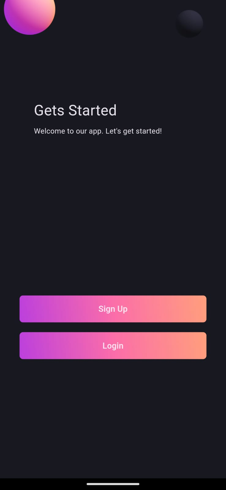
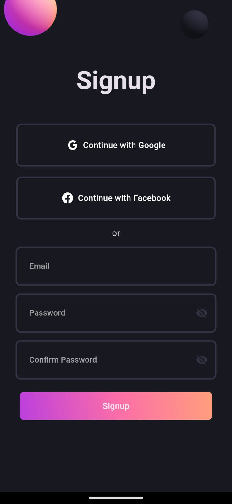
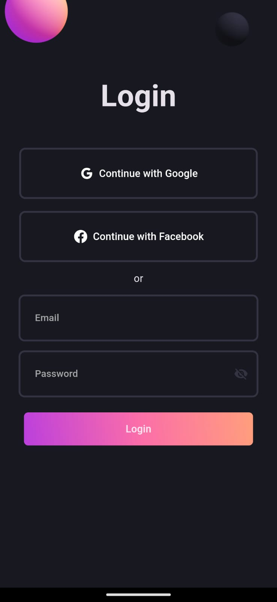
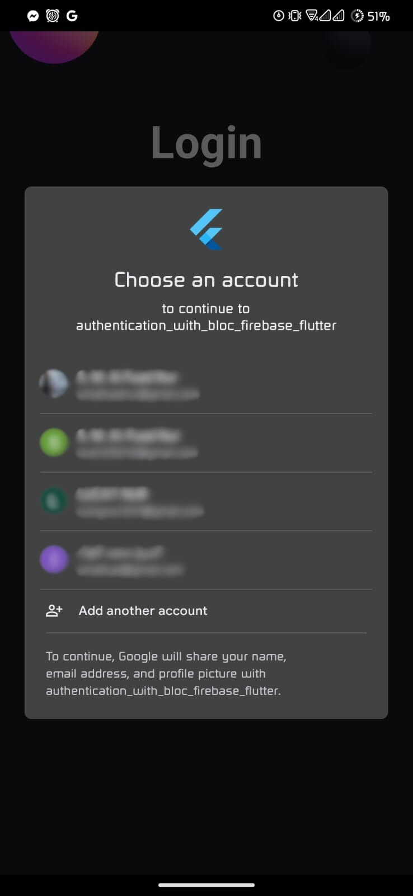
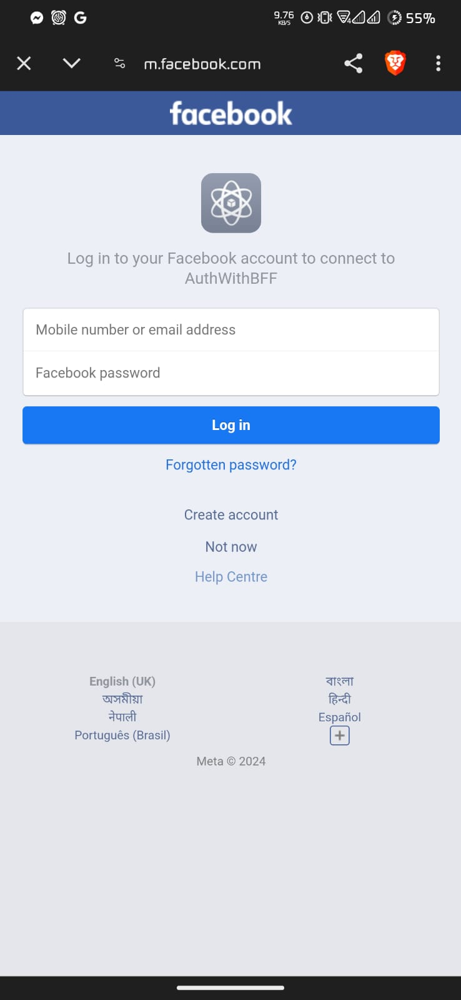
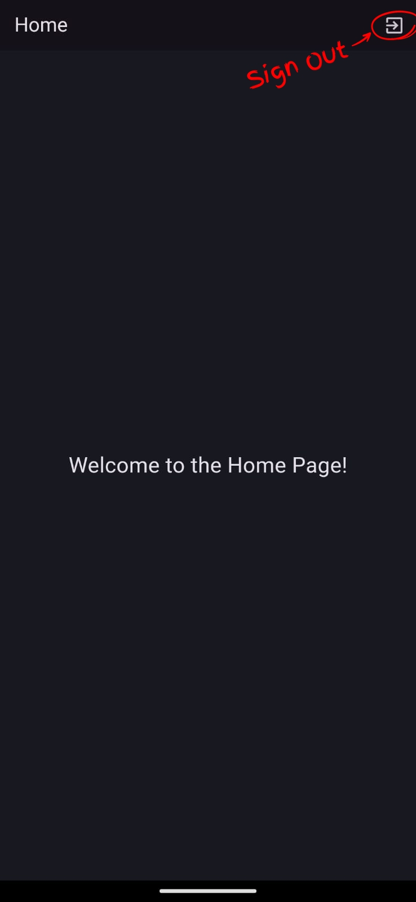

# authentication_with_bloc_firebase_flutter

Basic Authentication Flutter app with BLoC statemanagement using Firebase.

{width=50%}
{width=50%}
{width=50%}
{width=50%}
{width=50%}
{width=50%}
